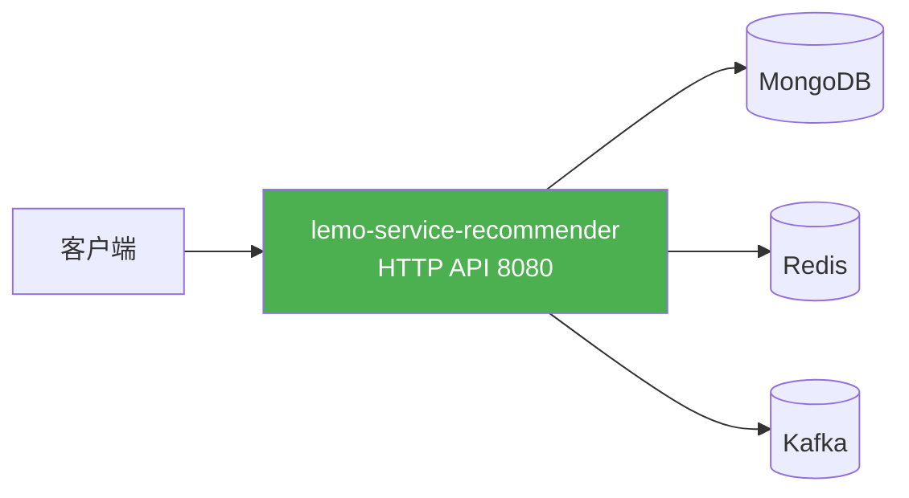
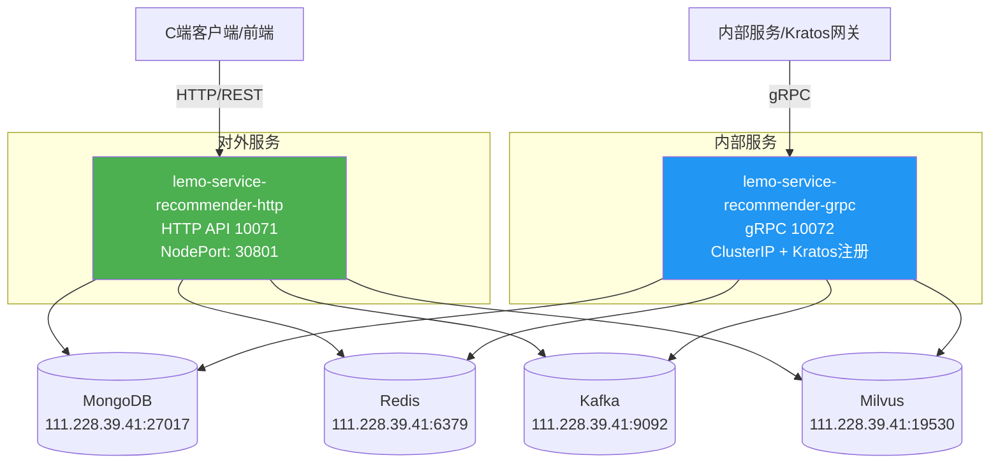
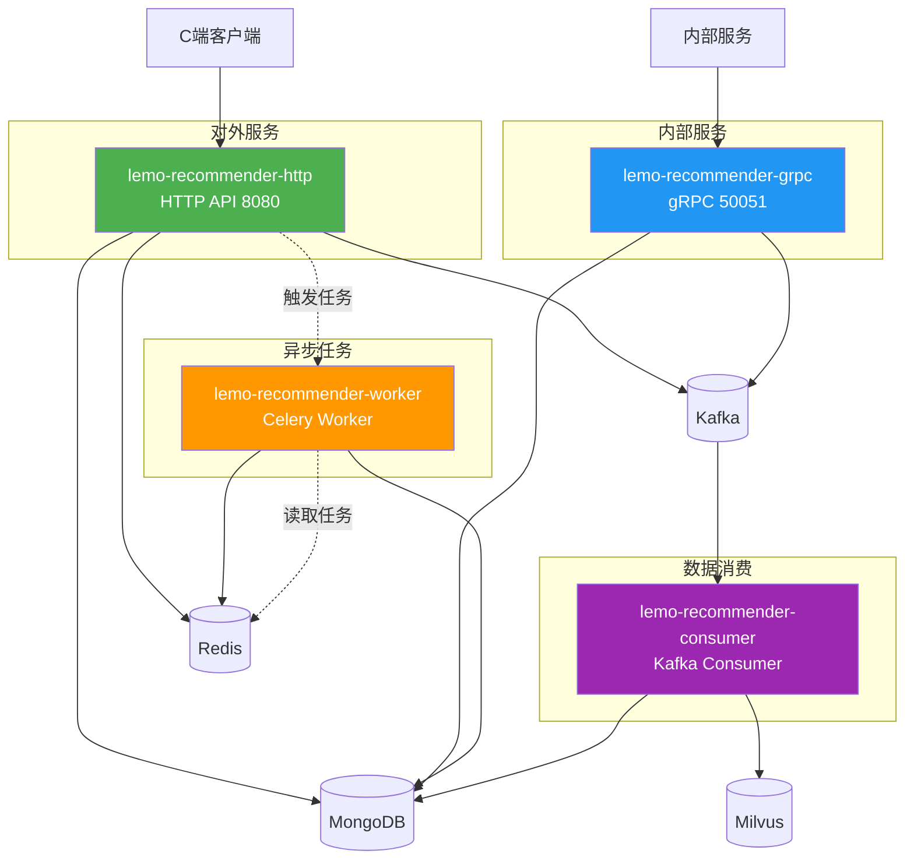

# 推荐系统服务架构与部署方案

> 📌 本文档说明推荐系统的服务拆分、功能覆盖、部署方案和资源需求

---

## 🎯 核心问题

**Q: 当前只部署 HTTP + gRPC 双服务，能支撑完整推荐系统吗？**

**A**: ❌ **不能完全支撑**，只能支撑约 **40%** 的功能。

- ✅ 可以提供基础推荐查询（基于规则/随机）
- ✅ 可以接收行为埋点和物品管理
- ❌ 无法训练模型、生成向量、更新画像
- ❌ 推荐质量会逐渐下降

**解决方案**：至少需要部署 **Celery Worker** 服务（强烈推荐⭐⭐⭐⭐⭐）

---

## 📊 当前现状 ✅

**已部署服务**（共2个）：

### 1. HTTP API 服务 ✅
- **Deployment**: `lemo-service-recommender-http`
- **端口**: 10071 (NodePort: 30801)
- **启动命令**: `uvicorn app.main:app --host 0.0.0.0 --port 10071`
- **功能**: REST API（场景、物品、推荐、埋点、管理后台等）
- **健康检查**: http://localhost:10071/health

### 2. gRPC 服务 ✅
- **Deployment**: `lemo-service-recommender-grpc`
- **端口**: 10072 (ClusterIP)
- **启动命令**: `python3 scripts/run_grpc_server.py`
- **功能**: gRPC 接口（8个服务：Scenario/Item/Behavior/Experiment/Analytics/Model/Template/Dataset）
- **服务发现**: 支持 Kratos 服务注册

**特点**：
- ✅ 使用同一个镜像 `lemo-service-recommender`
- ✅ 通过不同启动命令区分服务
- ✅ 共享 ConfigMap 配置
- ✅ HTTP + gRPC 双协议支持

**未部署服务**（可选）：
- ❌ Celery Worker（异步任务：模型训练、特征计算）
- ❌ Kafka Consumer（物品数据消费）

---

## 🎯 代码实际支持的独立服务

通过代码分析，项目实际支持以下**7个独立服务**：

### 核心在线服务（已部署 ✅）

#### 1. HTTP API 服务 ✅ (已部署)
**文件**: `app/main.py`  
**启动**: `uvicorn app.main:app --host 0.0.0.0 --port 10071`  
**端口**: 10071（NodePort: 30801）  
**功能**:
- REST API（场景、物品、推荐、埋点、AB实验等）
- 管理后台接口
- Swagger 文档（/api/v1/docs）
- 健康检查（/health）

#### 2. gRPC 服务 ✅ (已部署)
**文件**: `app/grpc_server/server.py`  
**启动**: `python3 scripts/run_grpc_server.py`  
**端口**: 10072（ClusterIP）  
**功能**:
- gRPC 接口（类型安全、高性能）
- 内部服务间通信
- Kratos 服务注册与发现
- 8个服务：Scenario/Item/Behavior/Experiment/Analytics/Model/Template/Dataset

---

### 后台处理服务（未部署 ❌，强烈推荐 ⭐）

#### 3. Celery Worker 服务 ❌ (未部署，重要！)
**文件**: `app/tasks/celery_app.py`  
**启动**: `celery -A app.tasks.celery_app worker -l info -c 4`  
**队列**: default, model_training, item_processing, user_profile  
**功能**:
- ⭐ **模型训练**（`model_tasks.py`）- 每天凌晨3点
- ⭐ **物品向量生成**（`item_tasks.py`）- 每小时
- ⭐ **用户画像更新**（`user_tasks.py`）- 每2小时
- ⭐ **推荐预计算**（`recommendation_tasks.py`）- 每4小时
- ⭐ **缓存清理**（`recommendation_tasks.py`）- 每天凌晨4点

**重要性**：⭐⭐⭐⭐⭐（没有 Worker，推荐系统无法训练模型和生成向量）

#### 4. Celery Beat 服务 ❌ (未部署，随 Worker 自动启动)
**文件**: `app/tasks/celery_app.py`  
**启动**: `celery -A app.tasks.celery_app beat -l info`  
**功能**:
- 定时任务调度器
- 触发定时模型训练
- 触发定时画像更新
- 触发定时缓存清理

**注意**：通常与 Worker 在同一个 Pod 中运行，或单独部署1个副本。

---

### 数据消费服务（未部署 ❌，可选）

#### 5. Kafka Consumer 服务 ❌ (未部署)
**文件**: `app/services/item/kafka_consumer.py`  
**启动**: `python3 -m app.services.item.kafka_consumer`  
**功能**:
- 消费物品事件（`item-events-{tenant_id}`）
- 物品数据写入 MongoDB
- 触发向量生成任务

**重要性**：⭐⭐⭐（Kafka 物品接入高性能，但可用 HTTP API 替代）

---

### 实时处理服务（未部署 ❌，可选）

#### 6. Flink Jobs 服务 ❌ (未部署)
**文件**: `scripts/run_flink_jobs.py`  
**启动**: `python scripts/run_flink_jobs.py --all`  
**包含**:
- **Job1: ClickHouseSink** - Kafka → ClickHouse（行为数据持久化）
- **Job2: ItemHotScoreCalculator** - 实时热度计算 → Redis
- **Job3: RealtimeMetricsAggregator** - 实时指标聚合 → Redis

**功能**:
- 实时特征计算
- 实时热度榜单
- 行为数据写入 ClickHouse
- 实时指标统计

**重要性**：⭐⭐⭐（实时数据处理，ToC 产品推荐部署）

---

### 模型服务（未部署 ❌，可选）

#### 7. 模型推理服务 ❌ (可选，未部署)
**文件**: `app/ml/model_server.py`  
**启动**: `python -m app.ml.model_server`  
**功能**:
- 独立模型推理服务
- TensorFlow Serving 或自定义
- 模型版本管理
- 高性能推理

**重要性**：⭐⭐（可选，大规模场景下推荐使用）

---

## 📋 完整推荐系统的功能模块分析

### 1️⃣ 在线服务层（已部署 ✅）

| 功能 | 当前状态 | 负责服务 | 说明 |
|------|---------|---------|------|
| **推荐查询** | ✅ 可用 | HTTP API / gRPC | 召回+排序+返回推荐结果 |
| **行为埋点** | ✅ 可用 | HTTP API / gRPC | 接收用户行为事件，写入 Kafka |
| **物品管理（API）** | ✅ 可用 | HTTP API / gRPC | 创建/更新/删除物品（直接写 MongoDB）|
| **场景配置** | ✅ 可用 | HTTP API / gRPC | 场景、模型、实验配置 |
| **AB实验** | ✅ 可用 | HTTP API / gRPC | 实验分流、指标统计 |
| **管理后台** | ✅ 可用 | HTTP API | 配置管理界面 |

**结论**：✅ 基础推荐查询功能完整，可以对外提供服务。

### 2️⃣ 异步处理层（未部署 ❌，严重影响推荐质量）

| 功能 | 当前状态 | 需要服务 | 影响 |
|------|---------|---------|------|
| **模型训练** | ❌ 不可用 | **Celery Worker** | 无法训练新模型、更新推荐算法 |
| **向量生成** | ❌ 不可用 | **Celery Worker** | 物品向量无法生成，向量召回不可用 |
| **用户画像更新** | ❌ 不可用 | **Celery Worker** | 用户画像不会更新，推荐不精准 |
| **推荐预计算** | ❌ 不可用 | **Celery Worker** | 无法预计算热门推荐，实时压力大 |
| **物品相似度计算** | ❌ 不可用 | **Celery Worker** | 协同过滤召回不可用 |

**结论**：❌ 所有后台任务无法执行，推荐质量会逐渐下降。**强烈建议部署 Worker！**

### 3️⃣ 数据消费层（未部署 ❌，中等影响）

| 功能 | 当前状态 | 需要服务 | 影响 |
|------|---------|---------|------|
| **物品 Kafka 接入** | ❌ 不可用 | **Kafka Consumer** | 无法从 Kafka 消费物品数据 |
| **物品向量自动生成** | ❌ 不可用 | **Kafka Consumer** | 新物品无法自动生成向量 |

**结论**：❌ Kafka 物品接入不可用，但可用 HTTP/gRPC API 替代。

### 4️⃣ 实时计算层（未部署 ❌，中等影响）

| 功能 | 当前状态 | 需要服务 | 影响 |
|------|---------|---------|------|
| **实时特征计算** | ❌ 不可用 | **Flink Jobs** | 用户实时特征无法计算 |
| **物品热度计算** | ❌ 不可用 | **Flink Jobs** | 热度榜单不会实时更新 |
| **实时指标统计** | ❌ 不可用 | **Flink Jobs** | 数据分析页面指标不准确 |
| **行为数据写 ClickHouse** | ❌ 不可用 | **Flink Jobs** | 行为数据无法持久化到 ClickHouse |

**结论**：❌ 实时数据处理完全缺失，但可用 Celery 定时聚合部分替代。

### 5️⃣ 定时任务层（未部署 ❌，严重影响）

| 功能 | 当前状态 | 需要服务 | 影响 |
|------|---------|---------|------|
| **定时模型训练** | ❌ 不可用 | **Celery Beat** | 模型不会自动训练，需要手动触发 |
| **定时画像更新** | ❌ 不可用 | **Celery Beat** | 用户画像不会定期更新 |
| **定时推荐预计算** | ❌ 不可用 | **Celery Beat** | 推荐不会定期预计算 |
| **定时缓存清理** | ❌ 不可用 | **Celery Beat** | 缓存不会自动清理，可能占满 Redis |

**结论**：❌ 所有定时任务无法自动执行，系统无法自我维护。

---

## 🚀 三种部署方案对比

### 方案1：单体服务（当前）

**优点**：
- ✅ 部署简单
- ✅ 运维成本低
- ✅ 适合初期/小规模

**缺点**：
- ❌ gRPC 不可用
- ❌ 异步任务不可用（模型训练、向量生成）
- ❌ Kafka 物品接入不可用
- ❌ 无法独立扩展

**适用场景**：Demo、POC、小规模测试

---

### 方案2：核心双服务（当前已部署 ✅）

**部署清单**（当前）：
1. ✅ `lemo-service-recommender-http`（HTTP API 服务）
2. ✅ `lemo-service-recommender-grpc`（gRPC 服务，支持Kratos服务发现）

**优点**：
- ✅ HTTP + gRPC 双接口
- ✅ 内部服务可用 gRPC（高性能）
- ✅ 可独立扩展 HTTP 和 gRPC
- ✅ 部署相对简单

**缺点**：
- ⚠️ 异步任务仍不可用
- ⚠️ Kafka 消费仍不可用

**适用场景**：中小规模生产环境、需要 gRPC 的场景

**资源需求**：
- HTTP: 2 副本 × (512Mi内存 + 0.5CPU) = 1Gi内存 + 1CPU
- gRPC: 2 副本 × (512Mi内存 + 0.5CPU) = 1Gi内存 + 1CPU
- **总计**: 2Gi内存 + 2CPU

---

### 方案3：完全拆分（大规模）

**部署清单**：
1. `lemo-recommender-http`（HTTP API 服务）
2. `lemo-recommender-grpc`（gRPC 服务）
3. `lemo-recommender-worker`（Celery Worker）
4. `lemo-recommender-consumer`（Kafka Consumer）

**优点**：
- ✅ 功能完整（HTTP、gRPC、异步任务、Kafka消费）
- ✅ 可独立扩展各服务
- ✅ 故障隔离（一个服务挂了不影响其他）
- ✅ 适合大规模生产

**缺点**：
- ⚠️ 运维复杂度高
- ⚠️ 资源消耗大

**适用场景**：大规模生产环境、高可用要求

**资源需求**：
- HTTP: 2 副本 × (512Mi + 0.5CPU) = 1Gi + 1CPU
- gRPC: 2 副本 × (512Mi + 0.5CPU) = 1Gi + 1CPU
- Worker: 2 副本 × (1Gi + 1CPU) = 2Gi + 2CPU
- Consumer: 1 副本 × (512Mi + 0.5CPU) = 512Mi + 0.5CPU
- **总计**: 4.5Gi内存 + 4.5CPU

---

## 📋 决策建议

### 如果你的场景是...

| 场景 | 推荐方案 | 理由 |
|------|---------|------|
| **刚开始，功能验证** | 方案1（单体） | 简单快速 |
| **需要内部服务调用** | 方案2（双服务）✅ | 平衡性价比 |
| **需要模型训练** | 方案3（完全拆分） | 必须有 Worker |
| **需要 Kafka 物品接入** | 方案3（完全拆分） | 必须有 Consumer |
| **资源有限（< 2Gi内存）** | 方案1（单体） | 省资源 |
| **生产环境，高可用** | 方案3（完全拆分） | 功能完整 |

### 当前状态 ✅

**已部署**：方案2（核心双服务）
- ✅ HTTP API 服务（10071端口，NodePort: 30801）
- ✅ gRPC 服务（10072端口，支持Kratos）

**下一步升级路径**：
- **如需模型训练** → 部署 Worker 服务（使用 `deploy-worker.sh`）
- **如需 Kafka 物品接入** → 部署 Consumer 服务（使用 `deploy-consumer.sh`）
- **需要完整功能** → 使用 `deploy-all-services.sh` 一键部署所有服务

---

## 🔧 具体实施

### 当前部署架构（方案2 ✅）

**部署脚本**：
- `deploy-http-grpc-service.sh` - 部署 HTTP + gRPC 双服务
- `deploy-worker-service.sh` - 部署 Celery Worker
- `deploy-beat-service.sh` - 部署 Celery Beat
- `deploy-consumer-service.sh` - 部署 Kafka Consumer
- `deploy-all-services.sh` - 一键部署所有服务（待创建）

**K8s 配置**：
- `k8s-deployment.yaml` - HTTP + gRPC 双服务配置（已完成）
- `k8s-deployment-worker.yaml` - Worker 服务配置（待创建）
- `k8s-deployment-consumer.yaml` - Consumer 服务配置（待创建）

**镜像策略**：
- 使用同一个镜像：`lemo-service-recommender`
- 通过不同启动命令运行不同服务：
  - HTTP: `uvicorn app.main:app --host 0.0.0.0 --port 10071`
  - gRPC: `python3 scripts/run_grpc_server.py`
  - Worker: `celery -A app.tasks.celery_app worker -l info`
  - Beat: `celery -A app.tasks.celery_app beat -l info`
  - Consumer: `python3 -m app.services.item.kafka_consumer`

---

## 🔍 常见问题 FAQ

### Q1：当前只部署 HTTP + gRPC，能否正常推荐？

**A**：✅ **可以**，但推荐质量会逐渐下降：
- **初期（1-2周）**：可以用规则推荐、热门推荐
- **中期（1个月后）**：无新模型训练，推荐效果固化
- **长期（3个月后）**：用户画像过期，推荐失去个性化

### Q2：不部署 Worker 会怎样？

**A**：❌ **严重影响**：
1. 无法训练模型 → 推荐基于规则
2. 无法生成向量 → 向量召回不可用
3. 无法更新画像 → 推荐不个性化
4. 无法预计算 → 推荐响应慢

**建议**：**必须部署 Worker** ⭐⭐⭐⭐⭐

### Q3：不部署 Flink 会怎样？

**A**：⚠️ **中等影响**：
1. 行为数据无法写 ClickHouse → 数据分析不可用
2. 实时特征无法计算 → 推荐延迟高
3. 热度榜单不更新 → 热门推荐不准

**建议**：
- **ToB SaaS**：可以暂时不部署，用 Celery 定时聚合代替
- **ToC 产品**：**建议部署**，实时性要求高

### Q4：不部署 Consumer 会怎样？

**A**：✅ **影响较小**：
1. Kafka 物品接入不可用 → 改用 HTTP/gRPC API
2. 物品无法自动生成向量 → 需要手动触发

**建议**：
- **物品量 < 10万**：可以不部署，用 API
- **物品量 > 10万**：**建议部署**，性能更好

### Q5：Beat 必须单独部署吗？

**A**：⚠️ **是的**：
- Beat 是定时任务调度器，只能有 **1个副本**
- 如果有多个 Beat，会导致任务重复执行
- 通常单独部署1个 Pod，资源占用很小（128Mi内存）

### Q6：各服务的功能覆盖率是多少？

| 部署方案 | 功能覆盖率 | 适用场景 |
|---------|-----------|---------|
| HTTP + gRPC | 40% | Demo、POC |
| + Worker + Beat | 75% | 基础生产环境 ⭐ |
| + Consumer | 80% | 中等规模生产 |
| + Flink Jobs | 100% | 大规模生产 |

---

## 📞 相关文档

- [系统设计.md](./系统设计.md) - 整体架构设计
- [数据分析架构方案.md](./数据分析架构方案.md) - 数据流架构
- [物品数据接入指南.md](./物品数据接入指南.md) - 物品接入方式
- [行为数据埋点指南.md](./行为数据埋点指南.md) - 埋点接入方式

