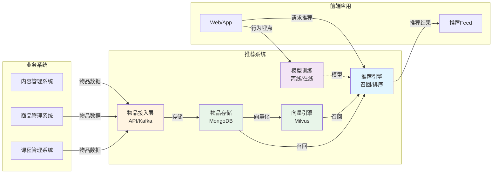

# 物品数据接入指南

本文档详细说明如何将业务系统的物品数据接入推荐系统，包括不同场景的数据结构规范、接入方式、数据流向、以及模型训练全流程。

---

## 📖 目录

- [1. 支持的接入方式](#-支持的接入方式)
- [2. 不同场景的物品数据结构](#-不同场景的物品数据结构)
- [3. 完整数据流向](#-完整数据流向)
- [4. API推送接入](#方式1api推送推荐)
- [5. Kafka消费接入](#方式2kafka消费)
- [6. 最佳实践](#-最佳实践)
- [7. 常见问题](#-常见问题)

---

## 🏗️ 系统架构概览

物品数据在推荐系统中的位置和流转：



**核心流程**：
1. 📥 **物品接入**：业务系统通过API/Kafka将物品数据推送到推荐系统
2. 💾 **数据存储**：MongoDB存储物品元数据（灵活Schema支持多场景）
3. 🧬 **向量生成**：提取文本特征，生成向量表示，存入Milvus
4. 🎯 **推荐召回**：基于向量、热度、标签等多路召回候选物品
5. 📊 **模型训练**：使用行为数据训练排序模型，优化推荐效果

---

## 🎯 支持的接入方式

推荐系统支持**两种**数据接入方式：

| 方式 | 适用场景 | 实时性 | 复杂度 |
|------|---------|--------|--------|
| **API推送** | 小规模、实时发布 | ⚡️ 秒级 | ⭐ 简单 |
| **Kafka消费** | 大规模、高吞吐 | ⚡️ 秒级 | ⭐⭐ 中等 |

---

## 📦 不同场景的物品数据结构

推荐系统支持多场景接入，每个场景的物品元数据（`metadata`）字段不同。系统采用**灵活Schema**设计，`metadata`为JSON对象，可根据场景自定义字段。

### 场景数据结构对比图

```mermaid
graph TD
    Item[物品数据Item]
    
    Item --> Common[通用必填字段]
    Item --> Scenario{场景特定字段}
    
    Common --> C1[item_id]
    Common --> C2[title]
    Common --> C3[description]
    Common --> C4[category]
    Common --> C5[tags]
    Common --> C6[publish_time]
    
    Scenario -->|视频场景| Video[Video Scenario]
    Scenario -->|电商场景| Ecom[Ecommerce Scenario]
    Scenario -->|新闻场景| News[News Scenario]
    Scenario -->|音乐场景| Music[Music Scenario]
    Scenario -->|教育场景| Edu[Education Scenario]
    Scenario -->|内容场景| Content[Content Scenario]
    Scenario -->|社交场景| Social[Social Scenario]
    Scenario -->|个性化场景| Person[Personalized Scenario]
    
    Video --> V1[video_url]
    Video --> V2[duration]
    Video --> V3[author_id]
    Video --> V4[completion_rate]
    
    Ecom --> E1[price]
    Ecom --> E2[stock]
    Ecom --> E3[brand]
    Ecom --> E4[sales_count]
    
    News --> N1[content]
    News --> N2[summary]
    News --> N3[keywords]
    News --> N4[sentiment]
    
    Music --> M1[audio_url]
    Music --> M2[artist]
    Music --> M3[album]
    Music --> M4[genre/mood]
    
    Edu --> Ed1[instructor]
    Edu --> Ed2[difficulty]
    Edu --> Ed3[lesson_count]
    Edu --> Ed4[rating]
    
    Content --> Ct1[content_type]
    Content --> Ct2[word_count]
    Content --> Ct3[topic]
    Content --> Ct4[quality_score]
    
    Social --> So1[user_profile]
    Social --> So2[follower_count]
    Social --> So3[influence_score]
    Social --> So4[relationship_type]
    
    Person --> Pe1[personalization_score]
    Person --> Pe2[match_reasons]
    Person --> Pe3[recommendation_strategy]
    Person --> Pe4[diversity_group]
    
    style Common fill:#e1f5ff
    style Video fill:#fff4e1
    style Ecom fill:#e8f5e9
    style News fill:#f3e5f5
    style Music fill:#ffe1f5
    style Edu fill:#fff9e1
    style Content fill:#e1ffe8
    style Social fill:#ffe8e1
    style Person fill:#f5e1ff
```



**设计理念**：
- 🔵 **通用字段**：所有场景共享，用于基础推荐（向量、标签、分类）
- 🟡 **视频字段**：播放时长、作者、完播率等视频特有指标
- 🟢 **电商字段**：价格、库存、品牌等商品特有属性
- 🟣 **新闻字段**：正文、关键词、情感等内容特有信息
- 🟠 **音乐字段**：歌手、专辑、曲风等音乐特有特征
- 🟡 **教育字段**：讲师、难度、课时等课程特有维度
- 🟢 **内容字段**：内容类型、话题、质量分等UGC内容特征
- 🔴 **社交字段**：用户画像、影响力、关系类型等社交特征
- 🟪 **个性化字段**：推荐分数、匹配理由、推荐策略等元信息

### 通用必填字段

所有场景都需要包含以下核心字段：

```json
{
  "item_id": "string",        // 必填：物品唯一ID
  "metadata": {
    "title": "string",        // 强烈推荐：物品标题（用于向量生成、搜索）
    "description": "string",  // 推荐：物品描述（用于向量生成）
    "category": "string",     // 推荐：分类（用于分类召回、过滤）
    "tags": ["string"],       // 推荐：标签列表（用于标签召回、相似计算）
    "publish_time": "ISO8601",// 推荐：发布时间（用于时间衰减、新物品冷启动）
    "cover_url": "string",    // 可选：封面图（前端展示）
    "status": "active"        // 可选：状态（active/inactive）
  }
}
```

### 场景1：视频场景（vlog、短视频、直播回放）

**适用场景**：抖音、快手、B站、YouTube类平台

```json
{
  "item_id": "video_20241030_001",
  "metadata": {
    // 通用字段
    "title": "北京秋天旅行Vlog | 故宫打卡",
    "description": "带你领略故宫秋天的美景...",
    "cover_url": "https://cdn.example.com/cover.jpg",
    "tags": ["旅行", "北京", "故宫", "秋天"],
    "category": "travel",
    "publish_time": "2024-10-30T10:00:00Z",
    
    // 视频特有字段 ⭐
    "video_url": "https://cdn.example.com/video.mp4",
    "duration": 180,              // 视频时长（秒）
    "resolution": "1080p",        // 分辨率
    "format": "mp4",              // 视频格式
    
    // 创作者信息
    "author": "旅行博主小王",
    "author_id": "user_123",
    "author_avatar": "https://cdn.example.com/avatar.jpg",
    "author_fans_count": 100000,  // 粉丝数
    
    // 统计数据（可选，可由行为数据实时计算）
    "view_count": 50000,          // 播放量
    "like_count": 3000,           // 点赞数
    "comment_count": 500,         // 评论数
    "share_count": 200,           // 分享数
    "completion_rate": 0.75,      // 平均完播率
    "avg_watch_duration": 135,    // 平均观看时长
    
    // 内容特征
    "has_bgm": true,              // 是否有背景音乐
    "has_subtitles": true,        // 是否有字幕
    "language": "zh-CN"           // 语言
  }
}
```

### 场景2：电商场景（商品推荐）

**适用场景**：淘宝、京东、拼多多类电商平台

```json
{
  "item_id": "product_SKU123456",
  "metadata": {
    // 通用字段
    "title": "Apple iPhone 15 Pro Max 256GB 钛金属",
    "description": "搭载A17 Pro芯片，支持卫星通讯...",
    "cover_url": "https://cdn.example.com/iphone.jpg",
    "tags": ["手机", "苹果", "5G", "高端"],
    "category": "electronics/mobile",
    "publish_time": "2024-09-15T00:00:00Z",
    
    // 电商特有字段 ⭐
    "price": 9999.00,             // 当前价格
    "original_price": 10999.00,   // 原价
    "discount": 0.91,             // 折扣率
    "currency": "CNY",            // 货币
    "stock": 500,                 // 库存
    "brand": "Apple",             // 品牌
    "model": "iPhone 15 Pro Max", // 型号
    "sku": "SKU123456",           // SKU编码
    
    // 商品属性
    "color": "钛金属",            // 颜色
    "size": "6.7英寸",            // 尺寸
    "weight": 221,                // 重量（克）
    "specs": {                    // 详细规格
      "storage": "256GB",
      "ram": "8GB",
      "chip": "A17 Pro"
    },
    
    // 商家信息
    "seller_id": "shop_apple_official",
    "seller_name": "Apple官方旗舰店",
    "is_official": true,          // 是否官方店
    
    // 销售数据
    "sales_count": 10000,         // 销量
    "rating": 4.8,                // 评分
    "review_count": 5000,         // 评价数
    "return_rate": 0.02,          // 退货率
    
    // 物流信息
    "shipping_free": true,        // 是否包邮
    "warehouse_location": "北京", // 仓库位置
    "delivery_time": "24小时发货" // 发货时效
  }
}
```

### 场景3：新闻/资讯场景

**适用场景**：今日头条、腾讯新闻、知乎类内容平台

```json
{
  "item_id": "article_20241030_001",
  "metadata": {
    // 通用字段
    "title": "AI技术突破：GPT-5即将发布",
    "description": "OpenAI宣布下一代大语言模型...",
    "cover_url": "https://cdn.example.com/news.jpg",
    "tags": ["科技", "AI", "GPT", "OpenAI"],
    "category": "technology",
    "publish_time": "2024-10-30T08:00:00Z",
    
    // 新闻特有字段 ⭐
    "content": "完整文章正文...",   // 全文内容（用于向量生成）
    "summary": "摘要...",          // 文章摘要
    "word_count": 1500,           // 字数
    "reading_time": 5,            // 预计阅读时长（分钟）
    
    // 作者/来源
    "author": "科技日报",
    "author_id": "media_tech_daily",
    "source": "科技日报官方",
    "is_verified": true,          // 是否认证媒体
    
    // 内容类型
    "article_type": "news",       // 类型：news/opinion/interview/report
    "has_video": false,           // 是否包含视频
    "has_images": true,           // 是否包含图片
    "image_count": 5,             // 图片数量
    
    // 互动数据
    "view_count": 100000,
    "like_count": 5000,
    "comment_count": 800,
    "share_count": 1200,
    "collect_count": 3000,        // 收藏数
    
    // 内容特征
    "sentiment": "neutral",       // 情感倾向：positive/neutral/negative
    "keywords": ["AI", "GPT-5", "OpenAI", "大语言模型"],
    "entities": {                 // 实体识别
      "persons": ["Sam Altman"],
      "organizations": ["OpenAI"],
      "locations": ["美国"]
    }
  }
}
```

### 场景4：音乐场景

**适用场景**：网易云音乐、QQ音乐、Spotify类音乐平台

```json
{
  "item_id": "song_123456",
  "metadata": {
    // 通用字段
    "title": "七里香",
    "description": "周杰伦经典歌曲",
    "cover_url": "https://cdn.example.com/album_cover.jpg",
    "tags": ["流行", "华语", "经典"],
    "category": "pop",
    "publish_time": "2004-08-03T00:00:00Z",
    
    // 音乐特有字段 ⭐
    "audio_url": "https://cdn.example.com/song.mp3",
    "duration": 300,              // 时长（秒）
    "artist": "周杰伦",           // 歌手
    "artist_id": "artist_jay",
    "album": "七里香",            // 专辑
    "album_id": "album_001",
    "genre": "pop",               // 曲风：pop/rock/jazz/classical
    "language": "zh-CN",          // 语言
    
    // 音频特征
    "bpm": 120,                   // 节拍（BPM）
    "key": "C major",             // 调性
    "mood": "romantic",           // 情绪：happy/sad/romantic/energetic
    "tempo": "moderate",          // 节奏：slow/moderate/fast
    
    // 质量信息
    "bitrate": 320,               // 比特率（kbps）
    "format": "mp3",              // 格式
    "quality": "high",            // 音质：low/medium/high/lossless
    
    // 版权信息
    "copyright": "杰威尔音乐",
    "is_vip_only": false,         // 是否会员专享
    "is_downloadable": true,      // 是否可下载
    
    // 统计数据
    "play_count": 500000000,      // 播放量
    "like_count": 10000000,       // 喜欢数
    "collect_count": 5000000,     // 收藏数
    "comment_count": 100000       // 评论数
  }
}
```

### 场景5：教育场景（课程、知识付费）

**适用场景**：得到、极客时间、B站课程类教育平台

```json
{
  "item_id": "course_python_101",
  "metadata": {
    // 通用字段
    "title": "Python零基础入门到精通",
    "description": "全面系统的Python编程课程...",
    "cover_url": "https://cdn.example.com/course_cover.jpg",
    "tags": ["编程", "Python", "入门", "后端"],
    "category": "programming/backend",
    "publish_time": "2024-01-01T00:00:00Z",
    
    // 教育特有字段 ⭐
    "instructor": "张老师",       // 讲师
    "instructor_id": "teacher_zhang",
    "instructor_title": "资深Python工程师", // 讲师头衔
    
    // 课程信息
    "course_type": "video",       // 类型：video/audio/text/live
    "difficulty": "beginner",     // 难度：beginner/intermediate/advanced
    "duration": 36000,            // 总时长（秒，10小时）
    "lesson_count": 100,          // 课时数
    "chapter_count": 10,          // 章节数
    
    // 价格信息
    "price": 199.00,              // 价格
    "original_price": 299.00,     // 原价
    "is_free": false,             // 是否免费
    "has_trial": true,            // 是否有试看
    
    // 学习数据
    "student_count": 50000,       // 学员数
    "completion_rate": 0.65,      // 完课率
    "avg_study_time": 7200,       // 平均学习时长
    "rating": 4.9,                // 评分
    "review_count": 3000,         // 评价数
    
    // 内容特征
    "has_homework": true,         // 是否有作业
    "has_certificate": true,      // 是否有证书
    "has_qa": true,               // 是否有问答
    "update_status": "completed", // 更新状态：ongoing/completed
    "last_update": "2024-06-01T00:00:00Z", // 最后更新时间
    
    // 适用人群
    "target_audience": ["编程新手", "在校学生", "转行人群"],
    "prerequisites": ["无需基础"],  // 前置要求
    "learning_outcomes": [         // 学习收获
      "掌握Python基础语法",
      "能够开发简单的Web应用",
      "了解数据分析基础"
    ]
  }
}
```

### 场景6：内容推荐场景（UGC内容、帖子、问答）

**适用场景**：知乎、小红书、微博类UGC内容平台

```json
{
  "item_id": "post_20241030_001",
  "metadata": {
    // 通用字段
    "title": "深度学习实战：从零搭建推荐系统",
    "description": "详细介绍如何从零开始搭建一个完整的推荐系统...",
    "cover_url": "https://cdn.example.com/post_cover.jpg",
    "tags": ["技术", "推荐系统", "深度学习", "实战"],
    "category": "tech/ai",
    "publish_time": "2024-10-30T10:00:00Z",
    
    // 内容特有字段 ⭐
    "content_type": "post",            // 内容类型：post/question/answer/gallery/thread
    "content": "完整内容正文...",      // 正文（可选，可能较长）
    "word_count": 2500,                // 字数
    "image_count": 8,                  // 图片数量
    "video_count": 1,                  // 视频数量
    "link_count": 3,                   // 链接数量
    
    // 作者信息
    "author": "技术大牛",
    "author_id": "user_tech_expert",
    "author_level": "资深作者",        // 作者等级
    "author_avatar": "https://cdn.example.com/avatar.jpg",
    "author_fans_count": 80000,        // 粉丝数
    "author_post_count": 500,          // 发帖数
    
    // 话题与质量
    "topic": "人工智能技术",           // 主话题
    "topics": ["推荐系统", "深度学习", "Python"],  // 相关话题
    "content_quality_score": 92,       // 内容质量分（0-100）
    "is_original": true,               // 是否原创
    "has_hashtags": true,              // 是否有标签
    "hashtags": ["#推荐系统", "#深度学习", "#实战教程"],
    
    // 互动数据
    "view_count": 50000,
    "like_count": 3500,
    "comment_count": 280,
    "share_count": 450,
    "collect_count": 1200,             // 收藏数
    "engagement_rate": 0.098,          // 互动率
    
    // 内容特征
    "read_time_estimate": 600,         // 预计阅读时长（秒）
    "has_code_snippet": true,          // 是否包含代码
    "has_external_links": true,        // 是否有外链
    "language": "zh-CN",               // 语言
    "content_format": "markdown"       // 内容格式
  }
}
```

### 场景7：社交推荐场景（好友推荐、关注推荐）

**适用场景**：社交网络平台的好友/关注推荐

```json
{
  "item_id": "user_profile_123456",
  "metadata": {
    // 通用字段
    "title": "李明 - 资深产品经理",
    "description": "10年产品经验，专注于AI和推荐系统...",
    "cover_url": "https://cdn.example.com/profile_bg.jpg",
    "tags": ["产品经理", "AI", "推荐系统", "创业"],
    "category": "professional/pm",
    "publish_time": "2020-01-01T00:00:00Z",  // 注册时间
    
    // 社交特有字段 ⭐
    "user_profile": {
      "username": "liming_pm",
      "nickname": "李明",
      "avatar": "https://cdn.example.com/avatar_liming.jpg",
      "gender": "male",
      "age": 32,
      "location": "北京市",
      "bio": "热爱产品，热爱技术"
    },
    
    // 社交数据
    "follower_count": 15000,           // 粉丝数
    "following_count": 500,            // 关注数
    "post_count": 800,                 // 发帖数
    "influence_score": 85.5,           // 影响力分数（0-100）
    "activity_level": "high",          // 活跃度：low/medium/high
    
    // 关系类型（针对当前用户）
    "relationship_type": "suggested",  // 关系：friend/following/mutual/suggested/stranger
    "mutual_friends_count": 12,        // 共同好友数
    "social_distance": 2,              // 社交距离（度数）
    "interaction_frequency": "medium", // 互动频率：low/medium/high
    
    // 兴趣与匹配
    "common_interests": ["AI", "产品设计", "创业"],  // 共同兴趣
    "similarity_score": 0.78,          // 相似度分数
    "interests": ["产品", "AI", "推荐系统", "创业", "阅读"],
    
    // 认证与标签
    "is_verified": true,               // 是否认证
    "verification_type": "personal",   // 认证类型：personal/company/media
    "badges": ["资深用户", "优质创作者", "技术达人"],
    
    // 统计数据
    "avg_post_engagement": 0.05,       // 平均帖子互动率
    "last_active_time": "2024-10-30T09:00:00Z",  // 最后活跃时间
    "account_age_days": 1764,          // 账号年龄（天）
    
    // 职业信息（可选）
    "profession": "产品经理",
    "company": "某科技公司",
    "industry": "互联网",
    "education": "清华大学"
  }
}
```

### 场景8：个性化推荐场景（综合推荐、Feed流）

**适用场景**：个性化Feed流、综合内容推荐

```json
{
  "item_id": "personalized_item_001",
  "metadata": {
    // 通用字段
    "title": "个性化推荐内容",
    "description": "基于你的兴趣推荐...",
    "cover_url": "https://cdn.example.com/cover.jpg",
    "tags": ["个性化", "推荐"],
    "category": "personalized",
    "publish_time": "2024-10-30T10:00:00Z",
    
    // 个性化特有字段 ⭐
    "personalization_score": 0.92,     // 个性化分数（0-1）
    "match_reasons": [                 // 推荐理由
      "兴趣匹配度92%",
      "好友都在看",
      "热门内容",
      "新鲜内容"
    ],
    "primary_reason": "兴趣匹配",      // 主要推荐理由
    
    // 用户匹配度
    "user_interests_match": 0.89,      // 用户兴趣匹配度
    "matched_interests": ["AI", "技术", "创业"],  // 匹配的兴趣点
    "user_profile_match": 0.75,        // 用户画像匹配度
    
    // 内容热度与新颖度
    "trending_score": 0.85,            // 热度分数
    "novelty_score": 0.68,             // 新颖度分数
    "recency_score": 0.72,             // 时效性分数
    "quality_score": 0.88,             // 质量分数
    
    // 推荐策略
    "recommendation_strategy": "hybrid",  // 推荐策略：collaborative/content_based/hybrid/deep_learning
    "model_version": "v3.2",           // 模型版本
    "algorithm": "two_tower_dnn",      // 使用的算法
    
    // 多样性控制
    "diversity_group": "tech_content", // 多样性分组
    "content_freshness": "recent",     // 内容新鲜度：new/recent/old
    
    // 特征权重（可选，用于解释）
    "feature_importance": {
      "collaborative_filtering": 0.35,
      "content_similarity": 0.25,
      "popularity": 0.20,
      "novelty": 0.10,
      "social_influence": 0.10
    },
    
    // 预测指标
    "predicted_ctr": 0.08,             // 预测点击率
    "predicted_engagement": 0.12,      // 预测互动率
    "predicted_dwell_time": 180,       // 预测停留时长（秒）
    
    // AB实验信息
    "experiment_id": "exp_personalized_v2",
    "experiment_group": "treatment",
    "model_confidence": 0.85,          // 模型置信度
    
    // 原始物品信息引用
    "source_item_id": "article_123",   // 源物品ID
    "source_item_type": "article",     // 源物品类型
    "source_scenario": "news"          // 源场景
  }
}
```

### 场景9：自定义场景

如果您的业务场景不在上述范围内，可以自定义`metadata`字段：

```json
{
  "item_id": "custom_item_001",
  "metadata": {
    // 至少包含基础字段
    "title": "物品标题",
    "description": "物品描述",
    "category": "自定义分类",
    "tags": ["标签1", "标签2"],
    
    // 自定义字段（任意JSON结构）
    "custom_field_1": "value1",
    "custom_field_2": 123,
    "custom_nested": {
      "key": "value"
    }
  }
}
```

### 字段设计原则 ⚠️

1. **必填字段最小化**：只有`item_id`是必填，其他字段根据场景选择
2. **推荐系统优化字段**：
   - `title` + `description` → 用于生成文本向量（相似推荐）
   - `tags` → 用于标签召回
   - `category` → 用于分类过滤
   - `publish_time` → 用于时间衰减、新物品冷启动
   - 统计数据（播放量、点赞数等） → 用于热度排序
3. **避免重复计算**：统计数据（如`view_count`）可由行为数据实时计算，无需每次更新物品
4. **向量生成字段**：包含丰富文本信息的字段（`title`、`description`、`tags`）将用于生成向量表示

---

## 🔄 完整数据流向

物品数据从接入到推荐召回的完整流程如下：

### Mermaid可视化流程图

```mermaid
graph TB
    Start[业务系统<br/>内容发布/商品上架] --> Choice{选择接入方式}
    
    Choice -->|实时发布| API[HTTP API推送<br/>POST /api/v1/items/batch]
    Choice -->|批量导入| Kafka[Kafka消息队列<br/>Topic: items-ingest]
    
    API --> Validation[数据验证与存储<br/>ItemService]
    Kafka --> Validation
    
    Validation --> MongoDB[(MongoDB<br/>items集合<br/>灵活Schema)]
    
    MongoDB --> KafkaEvent[发送Kafka事件<br/>item-events-{tenant_id}]
    
    KafkaEvent --> Parallel{并行处理}
    
    Parallel --> Embedding[向量生成<br/>EmbeddingService]
    Parallel --> Feature[特征工程<br/>FeatureService]
    
    Embedding --> EmbModel[调用向量模型<br/>OpenAI/BGE/M3E]
    EmbModel --> Milvus[(Milvus<br/>向量数据库<br/>IVF_FLAT/HNSW索引)]
    
    Feature --> FeatureExtract[提取特征<br/>类目/统计/时间/内容]
    FeatureExtract --> Redis1[(Redis<br/>特征缓存<br/>item:features:*)]
    
    Milvus --> Index[索引构建]
    Redis1 --> Index
    MongoDB --> Index
    
    Index --> Redis2[(Redis ZSET<br/>热度索引<br/>hot:items:*)]
    
    subgraph 离线模型训练
        ClickHouse[(ClickHouse<br/>行为数据)] --> DataPrep[数据准备<br/>样本构建]
        MongoDB --> DataPrep
        DataPrep --> Training[模型训练<br/>LightGBM/DeepFM/双塔]
        Training --> Evaluation[模型评估<br/>AUC/NDCG/CTR]
        Evaluation --> Deploy[模型部署<br/>更新配置]
    end
    
    subgraph 在线推荐服务
        Request[用户请求推荐] --> Recall[召回阶段<br/>多路召回]
        
        Milvus --> Recall
        Redis2 --> Recall
        MongoDB --> Recall
        
        Recall --> CoarseRank[粗排阶段<br/>简单过滤]
        CoarseRank --> FineRank[精排阶段<br/>LightGBM/DeepFM]
        
        Deploy -.->|加载模型| FineRank
        
        FineRank --> ReRank[重排阶段<br/>多样性/业务规则]
        ReRank --> Result[推荐结果<br/>Top20]
    end
    
    Result --> Behavior[用户行为埋点<br/>曝光/点击/转化]
    Behavior --> ClickHouse
    
    ClickHouse --> Monitor[效果监控<br/>Grafana大盘]
    Monitor -.->|模型迭代| Training
    
    style Start fill:#e1f5ff
    style API fill:#fff4e1
    style Kafka fill:#fff4e1
    style MongoDB fill:#e8f5e9
    style Milvus fill:#e8f5e9
    style Redis1 fill:#e8f5e9
    style Redis2 fill:#e8f5e9
    style ClickHouse fill:#e8f5e9
    style Result fill:#f3e5f5
    style Monitor fill:#f3e5f5
```

**流程说明**：
- 🟦 **蓝色**：数据源（业务系统）
- 🟨 **黄色**：接入层（API/Kafka）
- 🟩 **绿色**：存储层（MongoDB/Milvus/Redis/ClickHouse）
- 🟪 **紫色**：输出层（推荐结果、监控）

### ASCII艺术流程图（详细版）

```
┌─────────────────────────────────────────────────────────────────────┐
│                          1️⃣ 物品数据接入                              │
├─────────────────────────────────────────────────────────────────────┤
│                                                                       │
│  业务系统（内容发布、商品上架等）                                      │
│       │                                                               │
│       ├──► HTTP API: POST /api/v1/items/batch                        │
│       │    • 简单易用                                                 │
│       │    • 同步确认                                                 │
│       │    • 适合小规模                                               │
│       │                                                               │
│       └──► Kafka: Topic=items-ingest                                 │
│            • 高吞吐                                                   │
│            • 异步解耦                                                 │
│            • 适合大规模                                               │
│                                                                       │
└─────────────────────────────────────────────────────────────────────┘
                            ↓
┌─────────────────────────────────────────────────────────────────────┐
│                       2️⃣ 数据验证与存储                              │
├─────────────────────────────────────────────────────────────────────┤
│                                                                       │
│  ItemService (Python)                                                │
│       │                                                               │
│       ├──► 数据验证（tenant_id、item_id、必填字段）                   │
│       ├──► 去重检查（避免重复插入）                                   │
│       ├──► MongoDB存储                                                │
│       │    • Collection: items                                       │
│       │    • Index: {tenant_id, scenario_id, item_id}                │
│       │    • 灵活Schema（metadata为JSON）                            │
│       │                                                               │
│       └──► 返回处理结果                                               │
│                                                                       │
└─────────────────────────────────────────────────────────────────────┘
                            ↓
┌─────────────────────────────────────────────────────────────────────┐
│                       3️⃣ 事件分发（Kafka）                           │
├─────────────────────────────────────────────────────────────────────┤
│                                                                       │
│  KafkaProducer                                                       │
│       │                                                               │
│       └──► Topic: item-events-{tenant_id}                            │
│            • Message: {"event": "item_created", "item": {...}}       │
│            • Key: item_id（保证顺序）                                 │
│            • 触发下游处理                                             │
│                                                                       │
└─────────────────────────────────────────────────────────────────────┘
                            ↓
┌─────────────────────────────────────────────────────────────────────┐
│                       4️⃣ 向量生成（Embedding）                       │
├─────────────────────────────────────────────────────────────────────┤
│                                                                       │
│  EmbeddingService (异步任务)                                         │
│       │                                                               │
│       ├──► 从MongoDB读取物品                                          │
│       ├──► 提取文本特征                                               │
│       │    • title + description + tags                              │
│       │    • 场景特定字段（如video的author、product的brand）          │
│       │                                                               │
│       ├──► 调用向量模型                                               │
│       │    • OpenAI Embedding API                                    │
│       │    • SentenceTransformer（本地）                             │
│       │    • BGE/M3E（中文优化）                                      │
│       │    • 生成512/768/1024维向量                                   │
│       │                                                               │
│       ├──► 存储向量                                                   │
│       │    • Milvus（向量数据库） ⭐ 推荐                             │
│       │    • MongoDB（embedding字段）                                 │
│       │                                                               │
│       └──► 更新状态                                                   │
│            • MongoDB: {embedding_generated: true}                    │
│                                                                       │
└─────────────────────────────────────────────────────────────────────┘
                            ↓
┌─────────────────────────────────────────────────────────────────────┐
│                       5️⃣ 特征工程                                    │
├─────────────────────────────────────────────────────────────────────┤
│                                                                       │
│  FeatureService                                                      │
│       │                                                               │
│       ├──► 提取物品特征                                               │
│       │    • 类目特征：category、tags                                 │
│       │    • 统计特征：view_count、like_count、CTR                    │
│       │    • 时间特征：publish_time、freshness_score                  │
│       │    • 内容特征：duration、price、difficulty                    │
│       │    • 质量特征：rating、completion_rate                        │
│       │                                                               │
│       ├──► 特征归一化/编码                                            │
│       │    • 数值特征：MinMaxScaler、StandardScaler                  │
│       │    • 类别特征：OneHotEncoding、LabelEncoding                 │
│       │    • 文本特征：TF-IDF、Word2Vec                               │
│       │                                                               │
│       └──► 存储特征                                                   │
│            • Redis: item:features:{item_id} → HASH                   │
│            • MongoDB: items表增加features字段                         │
│                                                                       │
└─────────────────────────────────────────────────────────────────────┘
                            ↓
┌─────────────────────────────────────────────────────────────────────┐
│                       6️⃣ 索引构建                                    │
├─────────────────────────────────────────────────────────────────────┤
│                                                                       │
│  多种索引并行构建                                                      │
│                                                                       │
│  ├──► 向量索引（Milvus）                                             │
│  │    • IVF_FLAT / HNSW 索引                                         │
│  │    • 支持ANN（近似最近邻）搜索                                     │
│  │    • 用于相似物品召回                                              │
│  │                                                                   │
│  ├──► 倒排索引（Elasticsearch）可选                                  │
│  │    • 标题、标签、分类索引                                          │
│  │    • 支持全文搜索                                                  │
│  │                                                                   │
│  ├──► 热度索引（Redis ZSET）                                         │
│  │    • Key: hot:items:{tenant}:{scenario}                          │
│  │    • Score: 热度分数（加权计算）                                   │
│  │    • 用于热门召回                                                  │
│  │                                                                   │
│  └──► 类目索引（MongoDB Index）                                      │
│       • Index: {tenant_id, scenario_id, "metadata.category"}        │
│       • 用于分类筛选                                                  │
│                                                                       │
└─────────────────────────────────────────────────────────────────────┘
                            ↓
┌─────────────────────────────────────────────────────────────────────┐
│                       7️⃣ 推荐召回                                    │
├─────────────────────────────────────────────────────────────────────┤
│                                                                       │
│  RecallService（多路召回）                                            │
│       │                                                               │
│       ├──► 协同过滤召回（UserCF/ItemCF）                             │
│       │    • 基于行为数据计算相似度                                    │
│       │    • 从MongoDB/Redis读取用户历史行为                          │
│       │    • 召回Top100                                               │
│       │                                                               │
│       ├──► 向量召回（Embedding Based）⭐ 核心                        │
│       │    • 从Milvus查询相似向量                                     │
│       │    • 余弦相似度/欧氏距离                                       │
│       │    • 召回Top100                                               │
│       │                                                               │
│       ├──► 热门召回（Hot Items）                                     │
│       │    • 从Redis ZSET获取热门物品                                 │
│       │    • 按热度Score排序                                          │
│       │    • 召回Top50                                                │
│       │                                                               │
│       ├──► 标签召回（Tag Based）                                     │
│       │    • 匹配用户兴趣标签                                          │
│       │    • 从MongoDB按tags查询                                      │
│       │    • 召回Top50                                                │
│       │                                                               │
│       └──► 新物品召回（New Items）                                   │
│            • 按publish_time降序                                      │
│            • 冷启动策略                                                │
│            • 召回Top30                                                │
│                                                                       │
└─────────────────────────────────────────────────────────────────────┘
                            ↓
┌─────────────────────────────────────────────────────────────────────┐
│                       8️⃣ 模型训练（离线）                            │
├─────────────────────────────────────────────────────────────────────┤
│                                                                       │
│  ModelTrainingService (Celery定时任务)                               │
│       │                                                               │
│       ├──► 数据准备                                                   │
│       │    • ClickHouse读取行为数据（曝光、点击、转化）               │
│       │    • MongoDB读取物品特征                                      │
│       │    • 构建训练样本（正负样本）                                  │
│       │    • 特征拼接（用户特征 + 物品特征 + 上下文特征）             │
│       │                                                               │
│       ├──► 模型训练                                                   │
│       │    • 排序模型：LightGBM、DeepFM、Wide&Deep                   │
│       │    • 召回模型：双塔模型、DSSM                                 │
│       │    • CTR预估模型：xDeepFM、DCN                                │
│       │    • 训练集/验证集/测试集分割                                  │
│       │    • 超参数调优（GridSearch/Bayesian）                       │
│       │                                                               │
│       ├──► 模型评估                                                   │
│       │    • 离线指标：AUC、Precision、Recall、NDCG                  │
│       │    • 业务指标：CTR、转化率、留存率                             │
│       │    • A/B测试准备                                              │
│       │                                                               │
│       └──► 模型部署                                                   │
│            • 保存模型文件（pkl/onnx）                                 │
│            • 上传模型仓库                                              │
│            • 更新模型配置（MongoDB models表）                         │
│            • 通知推荐服务热更新                                        │
│                                                                       │
└─────────────────────────────────────────────────────────────────────┘
                            ↓
┌─────────────────────────────────────────────────────────────────────┐
│                       9️⃣ 推荐服务（在线）                            │
├─────────────────────────────────────────────────────────────────────┤
│                                                                       │
│  RecommendService                                                    │
│       │                                                               │
│       ├──► 用户请求推荐                                               │
│       │    • 获取用户画像（Redis/MongoDB）                            │
│       │    • 获取上下文信息（时间、地理位置、设备）                    │
│       │                                                               │
│       ├──► 召回阶段（Recall）                                        │
│       │    • 多路召回（步骤7️⃣）                                       │
│       │    • 召回候选集合并去重                                        │
│       │    • 候选集: ~300个物品                                        │
│       │                                                               │
│       ├──► 粗排阶段（Coarse Ranking）                                │
│       │    • 简单规则过滤（已看过、违规内容）                          │
│       │    • 快速打分（简单模型、特征少）                              │
│       │    • 筛选Top100                                               │
│       │                                                               │
│       ├──► 精排阶段（Fine Ranking）                                  │
│       │    • 加载精排模型（LightGBM/DeepFM）                          │
│       │    • 详细特征计算                                              │
│       │    • 预估CTR/转化率                                            │
│       │    • 排序TopN（N=20-50）                                      │
│       │                                                               │
│       ├──► 重排阶段（Re-Ranking）                                    │
│       │    • 多样性调整（避免同类物品堆积）                            │
│       │    • 业务规则（新物品插入、广告位）                            │
│       │    • AB实验分流                                               │
│       │    • 最终结果：Top20                                          │
│       │                                                               │
│       └──► 返回推荐结果                                               │
│            • 物品详情（从MongoDB/Redis获取）                          │
│            • 推荐理由（标签、相似物品）                                │
│            • 埋点参数（用于后续行为追踪）                              │
│                                                                       │
└─────────────────────────────────────────────────────────────────────┘
                            ↓
┌─────────────────────────────────────────────────────────────────────┐
│                       🔟 效果监控与迭代                               │
├─────────────────────────────────────────────────────────────────────┤
│                                                                       │
│  ├──► 行为数据采集（Behavior Tracking）                              │
│  │    • 曝光、点击、停留、转化                                        │
│  │    • Kafka → Flink → ClickHouse                                  │
│  │                                                                   │
│  ├──► 实时指标监控（Real-time Monitoring）                           │
│  │    • CTR、转化率、停留时长                                         │
│  │    • Grafana大盘展示                                              │
│  │    • 异常告警                                                      │
│  │                                                                   │
│  ├──► A/B测试分析（Experiment Analysis）                             │
│  │    • 对比实验组/对照组指标                                         │
│  │    • 统计显著性检验                                                │
│  │    • 决策是否全量                                                  │
│  │                                                                   │
│  └──► 模型迭代优化（Model Iteration）                                │
│       • 分析badcase（点击率低的推荐）                                 │
│       • 特征工程优化                                                   │
│       • 模型结构调整                                                   │
│       • 重新训练部署                                                   │
│                                                                       │
└─────────────────────────────────────────────────────────────────────┘
```

### 关键性能指标

| 环节 | 延迟 | 吞吐 | 说明 |
|-----|------|------|------|
| **物品接入（API）** | 100ms | 5K TPS | 同步写MongoDB + 异步发Kafka |
| **物品接入（Kafka）** | 10ms | 50K TPS | 直接写Kafka，消费者批量处理 |
| **向量生成** | 500ms/物品 | 批量处理 | 调用Embedding模型（可使用GPU加速） |
| **索引构建** | 秒级 | - | Milvus自动构建，增量更新 |
| **推荐召回** | 50ms | 10K QPS | 多路并行召回 |
| **模型训练** | 小时级 | - | 每天/每周离线训练 |
| **在线推荐** | 100ms | 10K QPS | 召回→粗排→精排→重排 |

---

## 方式1：API推送（推荐✅）

### 适用场景

- vlog发布后立即推荐
- 新闻发布后实时展示
- 中小规模数据量（< 10万/天）
- 业务系统支持HTTP调用

### 接入步骤

#### 1. 获取API凭证

- **租户ID**: `tenant_id`（由推荐系统分配）
- **API地址**: `http://recommender-api:8080/api/v1`

#### 2. 调用批量导入接口

**接口地址**:
```
POST /api/v1/items/batch
```

**请求头**:
```http
Content-Type: application/json
X-Tenant-Id: your_tenant_id
X-User-Id: system
```

**请求体**:
```json
{
  "scenario_id": "vlog_main_feed",
  "items": [
    {
      "item_id": "vlog_20241022_001",
      "metadata": {
        "title": "北京旅行Vlog",
        "author": "旅行博主",
        "author_id": "user_123",
        "duration": 180,
        "cover_url": "https://cdn.example.com/cover.jpg",
        "video_url": "https://cdn.example.com/video.mp4",
        "tags": ["旅行", "北京", "美食"],
        "category": "travel",
        "publish_time": "2024-10-22T10:00:00Z"
      }
    },
    {
      "item_id": "vlog_20241022_002",
      "metadata": {
        "title": "上海美食探店",
        "author": "美食达人",
        "duration": 240,
        "tags": ["美食", "上海"]
      }
    }
  ]
}
```

**响应示例**:
```json
{
  "success": true,
  "message": "成功创建2个物品，后续处理已启动",
  "data": {
    "count": 2,
    "processing": {
      "processed": 2,
      "source": "api",
      "tasks": {
        "kafka_sent": 2,
        "vector_queued": 2,
        "cache_updated": true
      },
      "timestamp": "2024-10-22T10:00:00.000Z"
    }
  }
}
```

#### 3. 后续处理（自动）

接口调用成功后，系统会自动：
1. ✅ 写入MongoDB
2. ✅ 发送Kafka事件（通知下游）
3. ✅ 触发向量生成（用于相似推荐）
4. ✅ 失效相关缓存

#### 4. 示例代码

**Python**:
```python
import requests

def publish_vlog_to_recommender(vlog_data):
    """vlog发布后调用推荐系统"""
    
    url = "http://recommender-api:8080/api/v1/items/batch"
    headers = {
        "Content-Type": "application/json",
        "X-Tenant-Id": "vlog_platform",
        "X-User-Id": "system"
    }
    
    payload = {
        "scenario_id": "vlog_main_feed",
        "items": [
            {
                "item_id": vlog_data["id"],
                "metadata": {
                    "title": vlog_data["title"],
                    "author": vlog_data["author"],
                    "duration": vlog_data["duration"],
                    "cover_url": vlog_data["cover_url"],
                    "tags": vlog_data["tags"]
                }
            }
        ]
    }
    
    response = requests.post(url, json=payload, headers=headers)
    
    if response.status_code == 200:
        result = response.json()
        print(f"✅ 推荐系统接入成功: {result}")
    else:
        print(f"❌ 推荐系统接入失败: {response.text}")
```

**Go**:
```go
func publishVlogToRecommender(vlog VlogData) error {
    url := "http://recommender-api:8080/api/v1/items/batch"
    
    payload := map[string]interface{}{
        "scenario_id": "vlog_main_feed",
        "items": []map[string]interface{}{
            {
                "item_id": vlog.ID,
                "metadata": map[string]interface{}{
                    "title":  vlog.Title,
                    "author": vlog.Author,
                    "tags":   vlog.Tags,
                },
            },
        },
    }
    
    body, _ := json.Marshal(payload)
    req, _ := http.NewRequest("POST", url, bytes.NewBuffer(body))
    req.Header.Set("Content-Type", "application/json")
    req.Header.Set("X-Tenant-Id", "vlog_platform")
    req.Header.Set("X-User-Id", "system")
    
    client := &http.Client{Timeout: 10 * time.Second}
    resp, err := client.Do(req)
    
    if err != nil {
        return err
    }
    defer resp.Body.Close()
    
    if resp.StatusCode == 200 {
        fmt.Println("✅ 推荐系统接入成功")
        return nil
    }
    
    return fmt.Errorf("推荐系统接入失败: %d", resp.StatusCode)
}
```

---

## 方式2：Kafka消费

### 适用场景

- 大规模数据接入（> 10万/天）
- 已有Kafka基础设施
- 需要削峰填谷
- 需要异步解耦

### 接入步骤

#### 1. 发送消息到Kafka

业务系统将物品数据发送到指定Topic。

**Topic命名规范**:
- `items-ingest` - 统一接入Topic（推荐）
- `vlog-items` - vlog专用Topic
- `news-items` - 新闻专用Topic
- `{业务}-items` - 自定义Topic（需配置）

**消息格式**:
```json
{
  "tenant_id": "vlog_platform",
  "scenario_id": "vlog_main_feed",
  "items": [
    {
      "item_id": "vlog_20241022_001",
      "metadata": {
        "title": "北京旅行Vlog",
        "author": "旅行博主",
        "duration": 180,
        "tags": ["旅行", "北京"]
      }
    }
  ]
}
```

**消息Key**（可选）:
- 使用 `tenant_id` 作为key，确保同一租户的消息有序

#### 2. 启动Kafka消费者（推荐系统侧）

推荐系统提供守护进程消费Kafka消息。

```bash
# 后台启动
nohup poetry run python scripts/run_item_consumer.py > logs/item_consumer.log 2>&1 &

# 或使用systemd
systemctl start recommender-item-consumer
```

#### 3. 监控消费状态

查看日志：
```bash
tail -f logs/item_consumer.log
```

输出示例：
```
[ItemKafkaConsumer] 收到消息: Topic=vlog-items, Tenant=vlog_platform, Scenario=vlog_main_feed, Items=10
[ItemKafkaConsumer] ✅ 写入MongoDB: 10个物品
[ItemKafkaConsumer] ✅ 处理完成: {'processed': 10, 'source': 'kafka', ...}
```

#### 4. 示例代码

**Python (使用aiokafka)**:
```python
from aiokafka import AIOKafkaProducer
import json

async def send_vlogs_to_kafka():
    producer = AIOKafkaProducer(
        bootstrap_servers='localhost:9092',
        value_serializer=lambda v: json.dumps(v).encode('utf-8')
    )
    
    await producer.start()
    
    message = {
        "tenant_id": "vlog_platform",
        "scenario_id": "vlog_main_feed",
        "items": [
            {
                "item_id": "vlog_001",
                "metadata": {"title": "旅行Vlog"}
            }
        ]
    }
    
    await producer.send('items-ingest', value=message, key=b'vlog_platform')
    await producer.stop()
```

**Go (使用sarama)**:
```go
func sendVlogsToKafka(vlogs []Vlog) error {
    config := sarama.NewConfig()
    config.Producer.Return.Successes = true
    
    producer, err := sarama.NewSyncProducer([]string{"localhost:9092"}, config)
    if err != nil {
        return err
    }
    defer producer.Close()
    
    message := map[string]interface{}{
        "tenant_id":   "vlog_platform",
        "scenario_id": "vlog_main_feed",
        "items":       vlogs,
    }
    
    msgBytes, _ := json.Marshal(message)
    
    _, _, err = producer.SendMessage(&sarama.ProducerMessage{
        Topic: "items-ingest",
        Key:   sarama.StringEncoder("vlog_platform"),
        Value: sarama.ByteEncoder(msgBytes),
    })
    
    return err
}
```

---

## 📊 两种方式对比

| 特性 | API推送 | Kafka消费 |
|------|--------|----------|
| **延迟** | 秒级 | 秒级 |
| **吞吐量** | 中等 | 极高 |
| **可靠性** | 同步确认 | 异步持久化 |
| **实现复杂度** | ⭐ 简单 | ⭐⭐ 中等 |
| **依赖组件** | 无 | Kafka集群 |
| **适合规模** | < 10万/天 | > 10万/天 |
| **削峰填谷** | ❌ 不支持 | ✅ 支持 |
| **消息回溯** | ❌ 不支持 | ✅ 支持 |

---

## 🚀 最佳实践

### 1. 接入方式选择

**根据业务场景选择接入方式**：

| 业务场景 | 推荐方式 | 理由 |
|---------|---------|------|
| 内容实时发布（vlog、文章） | **API推送** | 低延迟、同步确认、保证实时性 |
| 商品批量导入 | **Kafka消费** | 高吞吐、削峰填谷 |
| 历史数据迁移 | **Kafka消费** | 批量处理、不影响在线服务 |
| 定时数据同步 | **Kafka消费** | 异步解耦、可靠性高 |

**混合使用策略**：
- **实时发布**：使用API推送（低延迟、保证数据即时可用）
- **批量导入**：使用Kafka消费（高吞吐、系统解耦）
- **紧急修复**：使用API推送（立即生效）

### 2. 场景化数据设计

**不同场景包含不同的核心字段**：

#### 视频场景必填/推荐字段
```python
{
  "item_id": "必填",
  "metadata": {
    "title": "必填 - 用于向量、搜索",
    "video_url": "必填 - 播放地址",
    "duration": "必填 - 影响推荐策略",
    "author_id": "强烈推荐 - 用于作者召回",
    "cover_url": "强烈推荐 - 前端展示",
    "tags": "强烈推荐 - 标签召回",
    "category": "推荐 - 分类过滤",
    "publish_time": "推荐 - 时间衰减、冷启动",
    
    # 以下字段可由行为数据实时计算，无需每次更新
    "view_count": "可选",
    "like_count": "可选",
    "completion_rate": "可选"
  }
}
```

#### 电商场景必填/推荐字段
```python
{
  "item_id": "必填",
  "metadata": {
    "title": "必填 - 商品名称",
    "price": "必填 - 影响排序",
    "stock": "必填 - 过滤售罄商品",
    "brand": "强烈推荐 - 品牌召回",
    "category": "强烈推荐 - 分类召回",
    "tags": "推荐 - 标签召回",
    "cover_url": "推荐 - 前端展示",
    "description": "推荐 - 向量生成",
    
    # 以下字段影响转化率预估
    "rating": "推荐",
    "sales_count": "推荐",
    "discount": "推荐"
  }
}
```

#### 新闻/资讯场景必填/推荐字段
```python
{
  "item_id": "必填",
  "metadata": {
    "title": "必填 - 标题是核心",
    "content": "必填 - 全文用于向量",
    "summary": "强烈推荐 - 摘要展示",
    "category": "强烈推荐 - 分类召回",
    "tags": "强烈推荐 - 兴趣匹配",
    "publish_time": "必填 - 新闻时效性",
    "author_id": "推荐 - 媒体/作者召回",
    "keywords": "推荐 - 关键词匹配"
  }
}
```

#### 音乐场景必填/推荐字段
```python
{
  "item_id": "必填",
  "metadata": {
    "title": "必填 - 歌曲名",
    "artist": "必填 - 歌手名（核心特征）",
    "audio_url": "必填 - 播放地址",
    "duration": "必填 - 影响推荐",
    "genre": "强烈推荐 - 曲风召回",
    "mood": "推荐 - 情绪推荐",
    "album": "推荐 - 专辑推荐",
    "tags": "推荐 - 标签召回"
  }
}
```

#### 教育场景必填/推荐字段
```python
{
  "item_id": "必填",
  "metadata": {
    "title": "必填 - 课程名称",
    "instructor": "必填 - 讲师（核心特征）",
    "difficulty": "必填 - 难度匹配",
    "category": "强烈推荐 - 分类召回",
    "price": "推荐 - 价格过滤",
    "duration": "推荐 - 时长匹配",
    "tags": "推荐 - 技能标签",
    "rating": "推荐 - 质量评估"
  }
}
```

#### 内容推荐场景必填/推荐字段
```python
{
  "item_id": "必填",
  "metadata": {
    "title": "必填 - 内容标题",
    "content_type": "必填 - 内容类型（post/question/answer）",
    "author_id": "必填 - 作者ID",
    "topic": "强烈推荐 - 话题分类",
    "word_count": "推荐 - 内容长度",
    "tags": "推荐 - 标签召回",
    "content_quality_score": "推荐 - 质量过滤",
    "is_original": "推荐 - 原创内容标识"
  }
}
```

#### 社交推荐场景必填/推荐字段
```python
{
  "item_id": "必填 - 用户ID",
  "metadata": {
    "title": "必填 - 用户名称/昵称",
    "user_profile": "必填 - 用户基本信息",
    "follower_count": "强烈推荐 - 影响力指标",
    "influence_score": "强烈推荐 - 影响力分数",
    "interests": "强烈推荐 - 兴趣匹配",
    "relationship_type": "推荐 - 关系类型",
    "is_verified": "推荐 - 认证标识",
    "mutual_friends_count": "推荐 - 社交距离"
  }
}
```

#### 个性化推荐场景必填/推荐字段
```python
{
  "item_id": "必填",
  "metadata": {
    "title": "必填 - 内容标题",
    "personalization_score": "必填 - 个性化分数",
    "match_reasons": "强烈推荐 - 推荐理由",
    "recommendation_strategy": "强烈推荐 - 推荐策略",
    "source_item_id": "必填 - 源物品ID",
    "source_item_type": "必填 - 源物品类型",
    "predicted_ctr": "推荐 - 预测点击率",
    "diversity_group": "推荐 - 多样性控制"
  }
}
```

### 3. 数据质量保证

#### 字段验证
```python
# Python示例：发送前验证
def validate_item_data(item: dict, scenario: str) -> bool:
    """验证物品数据"""
    
    # 通用必填字段
    if not item.get("item_id"):
        raise ValueError("item_id是必填字段")
    
    metadata = item.get("metadata", {})
    
    # 场景特定验证
    if scenario == "video":
        required = ["title", "video_url", "duration"]
        for field in required:
            if not metadata.get(field):
                raise ValueError(f"视频场景必须包含{field}字段")
    
    elif scenario == "ecommerce":
        required = ["title", "price", "stock"]
        for field in required:
            if not metadata.get(field):
                raise ValueError(f"电商场景必须包含{field}字段")
        
        # 价格校验
        if metadata["price"] < 0:
            raise ValueError("价格不能为负数")
    
    return True
```

#### 数据清洗
- **去除HTML标签**：`title`和`description`中的HTML需要清理
- **统一时间格式**：使用ISO8601格式（`2024-10-30T10:00:00Z`）
- **标签标准化**：统一大小写、去重、限制数量（建议5-10个）
- **文本长度限制**：
  - `title`: 1-200字符
  - `description`: 1-5000字符
  - `tags`: 每个标签2-20字符

### 4. 性能优化

#### 批量提交
**推荐做法** ✅：
```python
# 批量提交（每批100-500个物品）
items = [...]  # 500个物品
response = requests.post(
    "http://recommender-api:8080/api/v1/items/batch",
    json={"scenario_id": "vlog_main_feed", "items": items}
)
```

**不推荐做法** ❌：
```python
# 逐个提交（网络开销大）
for item in items:
    response = requests.post(...)  # 500次网络请求
```

#### 并发控制
```python
# 使用连接池 + 并发
import asyncio
import aiohttp

async def batch_upload_items(items_batches: list):
    """并发上传多批物品"""
    async with aiohttp.ClientSession() as session:
        tasks = [
            upload_batch(session, batch) 
            for batch in items_batches
        ]
        results = await asyncio.gather(*tasks)
    return results
```

#### Kafka优化
```python
# Kafka批量发送
from aiokafka import AIOKafkaProducer

producer = AIOKafkaProducer(
    bootstrap_servers='localhost:9092',
    # 批量发送配置
    linger_ms=100,          # 等待100ms积累消息
    batch_size=16384,       # 批量大小16KB
    compression_type='lz4'  # 压缩（减少网络开销）
)
```

### 5. 错误处理与重试

#### API推送重试策略
```python
import time
from typing import Optional

def push_items_with_retry(
    items: list, 
    max_retries: int = 3
) -> Optional[dict]:
    """带重试的API推送"""
    
    for attempt in range(max_retries):
        try:
            response = requests.post(
                url="http://recommender-api:8080/api/v1/items/batch",
                json={"scenario_id": "vlog_main_feed", "items": items},
                headers={"X-Tenant-Id": "tenant_001"},
                timeout=10  # 超时时间
            )
            
            if response.status_code == 200:
                return response.json()
            elif response.status_code >= 500:
                # 服务端错误，可重试
                wait_time = 2 ** attempt  # 指数退避：2s, 4s, 8s
                time.sleep(wait_time)
                continue
            else:
                # 客户端错误（4xx），不重试
                print(f"客户端错误: {response.status_code}")
                return None
        
        except requests.exceptions.Timeout:
            print(f"请求超时，重试 {attempt + 1}/{max_retries}")
            continue
        except Exception as e:
            print(f"未知错误: {e}")
            return None
    
    print("重试次数已用尽")
    return None
```

#### 失败日志记录
```python
import logging

# 记录失败的物品，便于后续补录
failed_items_logger = logging.getLogger("failed_items")
failed_items_logger.addHandler(
    logging.FileHandler("failed_items.log")
)

# 推送失败时记录
if not result:
    failed_items_logger.error(
        f"物品推送失败: {json.dumps(item)}"
    )
```

### 6. 监控与告警

#### 关键指标监控

| 指标 | 阈值 | 告警级别 |
|-----|------|---------|
| **API成功率** | > 99.9% | P0（立即响应） |
| **API P99延迟** | < 200ms | P1（1小时内） |
| **Kafka消费延迟** | < 1秒 | P1 |
| **向量生成成功率** | > 99% | P2（4小时内） |
| **物品接入量** | 监控突增/突降 | P2 |
| **重复物品率** | < 1% | P3（日报告） |

#### Prometheus监控示例
```python
from prometheus_client import Counter, Histogram

# 物品接入计数
items_ingested = Counter(
    'items_ingested_total',
    'Total items ingested',
    ['tenant_id', 'scenario_id', 'status']
)

# 物品接入延迟
items_ingest_latency = Histogram(
    'items_ingest_latency_seconds',
    'Item ingest latency',
    ['method']  # api or kafka
)

# 记录指标
items_ingested.labels(
    tenant_id='tenant_001',
    scenario_id='vlog_main_feed',
    status='success'
).inc()
```

### 7. 数据更新策略

#### 增量更新
- **新增物品**：直接调用接入接口
- **修改物品**：使用`PUT /api/v1/items/{item_id}`更新
- **删除物品**：使用`DELETE /api/v1/items/{item_id}`（软删除，不影响历史数据）

#### 全量更新
```python
# 场景：每天凌晨全量同步商品库存/价格
async def daily_full_sync():
    """全量同步（建议使用Kafka）"""
    
    # 1. 从业务系统获取全量数据
    all_products = fetch_all_products_from_db()
    
    # 2. 分批发送到Kafka
    batch_size = 1000
    for i in range(0, len(all_products), batch_size):
        batch = all_products[i:i + batch_size]
        await send_to_kafka(topic='items-ingest', items=batch)
    
    # 3. 标记删除的物品（不在全量数据中的物品）
    await mark_deleted_items(all_products)
```

### 8. 安全与权限

#### 租户隔离
```python
# 请求头必须包含租户ID
headers = {
    "X-Tenant-Id": "tenant_001",  # 必填
    "X-User-Id": "system",         # 系统账号
    "Content-Type": "application/json"
}
```

#### 敏感数据处理
- **不要传输敏感信息**：如用户隐私、商业机密
- **URL加密**：`video_url`、`audio_url`建议使用CDN签名URL
- **价格脱敏**（可选）：仅传输价格区间而非精确价格

---

## ❓ 常见问题

### Q1: API推送失败怎么办？

**A**: 实现重试机制。如果持续失败，按以下步骤排查：

1. **检查租户ID**：
   ```bash
   # 确认租户ID是否正确
   curl -H "X-Tenant-Id: your_tenant_id" \
     "http://recommender-api:8080/api/v1/scenarios"
   ```

2. **检查网络连接**：
   ```bash
   # 测试连通性
   curl -v http://recommender-api:8080/health
   ```

3. **查看错误日志**：
   - 4xx错误：检查请求数据格式
   - 5xx错误：联系推荐系统团队
   - 超时：检查物品数据大小（建议单批 < 500个）

4. **实现重试**：参考[最佳实践 - 错误处理](#5-错误处理与重试)

### Q2: Kafka消息积压怎么办？

**A**: Kafka消息积压通常由以下原因导致：

**诊断步骤**：
```bash
# 查看消费者lag
kafka-consumer-groups --bootstrap-server localhost:9092 \
  --describe --group item-consumer-group

# 输出示例：
# TOPIC           PARTITION  CURRENT-OFFSET  LOG-END-OFFSET  LAG
# items-ingest    0          1000            5000            4000  ← 积压4000条
```

**解决方案**：

1. **水平扩展消费者**：
   ```bash
   # 启动更多消费者实例
   docker-compose up -d --scale item-consumer=3
   ```

2. **检查MongoDB写入性能**：
   ```python
   # 启用批量写入
   await collection.insert_many(documents, ordered=False)
   ```

3. **优化向量生成**：
   ```python
   # 异步处理，不阻塞消费
   asyncio.create_task(generate_embedding(item))
   ```

4. **临时方案**：暂停向量生成，优先保证物品存储

### Q3: 如何确认数据接入成功？

**A**: 三种验证方式：

#### 方式1：API响应验证
```python
response = requests.post(...)
result = response.json()

# 检查processing字段
print(result['data']['processing'])
# 输出：
# {
#   "processed": 10,
#   "source": "api",
#   "tasks": {
#     "kafka_sent": 10,
#     "vector_queued": 10,
#     "cache_updated": true
#   }
# }
```

#### 方式2：查询物品接口
```bash
# 按item_id查询
curl -H "X-Tenant-Id: tenant_001" \
  "http://recommender-api:8080/api/v1/items/video_001?scenario_id=vlog_main_feed"

# 列表查询
curl -H "X-Tenant-Id: tenant_001" \
  "http://recommender-api:8080/api/v1/items?scenario_id=vlog_main_feed&page=1&page_size=20"
```

#### 方式3：MongoDB直接查询
```javascript
// MongoDB Shell
use recommender;
db.items.findOne({
  "tenant_id": "tenant_001",
  "scenario_id": "vlog_main_feed",
  "item_id": "video_001"
});
```

#### 方式4：查看向量生成状态
```bash
# 检查是否生成向量
curl -H "X-Tenant-Id: tenant_001" \
  "http://recommender-api:8080/api/v1/items/video_001" | jq '.embedding'

# 输出：
# [0.123, -0.456, 0.789, ...]  ← 已生成
# null                          ← 未生成（正在队列中）
```

### Q4: 如何新增自定义Topic？

**A**: 修改配置文件并重启消费者：

```bash
# 1. 修改配置
# config/prod.env
KAFKA_ITEM_INGEST_TOPICS=items-ingest,vlog-items,news-items,your-custom-topic

# 2. 创建Topic（如果不存在）
kafka-topics --create \
  --bootstrap-server localhost:9092 \
  --topic your-custom-topic \
  --partitions 12 \
  --replication-factor 3

# 3. 重启消费者
docker-compose restart item-consumer
```

### Q5: 不同场景的物品可以共存吗？

**A**: 可以。推荐系统支持多场景、多租户架构：

```python
# 同一租户下的不同场景
{
  "tenant_id": "media_platform",
  "scenario_id": "vlog_feed",      # vlog场景
  "items": [...]
}

{
  "tenant_id": "media_platform",
  "scenario_id": "news_feed",      # 新闻场景
  "items": [...]
}

# 不同场景的物品完全隔离，互不影响
```

**注意事项**：
- 每个场景独立管理物品
- `item_id`在**同一场景内**必须唯一
- 不同场景的`item_id`可以重复（通过`scenario_id`区分）
- 推荐结果仅返回当前场景的物品

### Q6: 如何处理大文本字段（如新闻全文）？

**A**: 针对大文本字段（如新闻`content`、商品`description`），有两种策略：

#### 策略1：直接存储（推荐）
```json
{
  "item_id": "article_001",
  "metadata": {
    "title": "标题",
    "content": "完整文章内容（可能很长）...",  // 直接存储
    "summary": "摘要（用于前端展示）"
  }
}
```
- **优点**：向量生成质量高、语义理解准确
- **缺点**：MongoDB存储占用较大
- **适用**：MongoDB存储充足、需要精准推荐

#### 策略2：仅存储摘要
```json
{
  "item_id": "article_001",
  "metadata": {
    "title": "标题",
    "summary": "摘要（300-500字）",        // 仅存储摘要
    "content_url": "https://..."          // 原文链接
  }
}
```
- **优点**：存储占用小、传输快
- **缺点**：向量生成依赖摘要质量
- **适用**：存储受限、原文存储在其他系统

#### 策略3：分段存储（高级）
```json
{
  "item_id": "article_001",
  "metadata": {
    "title": "标题",
    "summary": "摘要",
    "content_chunks": [              // 分段存储
      "第一段内容...",
      "第二段内容...",
      "第三段内容..."
    ]
  }
}
```
- **优点**：兼顾存储和语义
- **缺点**：需要自定义分段逻辑
- **适用**：长文本推荐（如书籍、论文）

**推荐做法**：
- 新闻/文章：存储`summary`（300-500字）+ `content_url`
- 商品：存储`description`（500字以内）
- 视频/音乐：存储`title` + `tags`（无需正文）

### Q7: 物品数据更新后，多久能在推荐结果中看到？

**A**: 数据流时效性如下：

| 环节 | 时效 | 说明 |
|-----|------|------|
| **物品写入MongoDB** | 秒级（< 3s） | API推送立即写入 |
| **向量生成** | 分钟级（1-5分钟） | 异步队列处理 |
| **索引更新（Milvus）** | 分钟级（1-3分钟） | 自动增量更新 |
| **推荐结果可见** | **3-8分钟** | 所有环节完成后 |
| **热度索引更新** | 小时级（1小时） | 定时任务计算 |

**加速方式**：
1. **跳过向量生成**（临时）：
   ```python
   # 先插入物品，稍后补充向量
   await item_service.create_item(data, generate_embedding=False)
   ```

2. **使用预计算向量**：
   ```json
   {
     "item_id": "video_001",
     "metadata": {...},
     "embedding": [0.1, 0.2, ...]  // 客户端预计算向量
   }
   ```

3. **使用热门召回**：新物品通过热门召回路径立即可见

### Q8: 如何批量删除/下架物品？

**A**: 两种删除方式：

#### 方式1：软删除（推荐）
```bash
# 单个删除
curl -X DELETE \
  -H "X-Tenant-Id: tenant_001" \
  "http://recommender-api:8080/api/v1/items/video_001?scenario_id=vlog_main_feed"

# 批量删除（通过脚本）
for item_id in item_id_list:
    requests.delete(f"http://recommender-api:8080/api/v1/items/{item_id}")
```
- 物品状态变为`deleted`
- 不出现在推荐结果中
- 历史行为数据保留（用于分析）

#### 方式2：硬删除（谨慎）
```bash
curl -X DELETE \
  -H "X-Tenant-Id: tenant_001" \
  "http://recommender-api:8080/api/v1/items/video_001?scenario_id=vlog_main_feed&hard_delete=true"
```
- 彻底删除物品数据
- 向量索引同步删除
- **不可恢复**

**批量删除最佳实践**：
```python
# Python批量软删除脚本
import asyncio
import aiohttp

async def batch_delete_items(item_ids: list):
    """批量删除物品（并发）"""
    async with aiohttp.ClientSession() as session:
        tasks = []
        for item_id in item_ids:
            url = f"http://recommender-api:8080/api/v1/items/{item_id}"
            tasks.append(
                session.delete(
                    url,
                    headers={"X-Tenant-Id": "tenant_001"},
                    params={"scenario_id": "vlog_main_feed"}
                )
            )
        
        results = await asyncio.gather(*tasks, return_exceptions=True)
        
        success = sum(1 for r in results if not isinstance(r, Exception))
        print(f"成功删除: {success}/{len(item_ids)}")

# 使用
await batch_delete_items(["video_001", "video_002", ...])
```

### Q9: 推荐系统是否支持物品属性更新（如价格、库存）？

**A**: 支持，使用`PUT`接口更新：

```bash
# 更新商品价格
curl -X PUT \
  -H "X-Tenant-Id: tenant_001" \
  -H "Content-Type: application/json" \
  "http://recommender-api:8080/api/v1/items/product_001?scenario_id=ecommerce_main" \
  -d '{
    "metadata": {
      "price": 8999.00,
      "stock": 100
    }
  }'
```

**注意事项**：
- 仅更新`metadata`字段，其他字段不变
- 不会重新生成向量（除非显式指定`regenerate_embedding=true`）
- 适用于高频更新字段（价格、库存、统计数据）

**高频更新建议**：
```python
# 每小时同步一次价格/库存
import schedule

def sync_prices():
    """从业务系统同步价格"""
    products = fetch_products_from_db()
    
    for product in products:
        requests.put(
            f"http://recommender-api:8080/api/v1/items/{product['id']}",
            json={
                "metadata": {
                    "price": product["price"],
                    "stock": product["stock"]
                }
            }
        )

schedule.every().hour.do(sync_prices)
```

### Q10: 向量生成使用哪个模型？可以自定义吗？

**A**: 当前支持的向量模型：

| 模型 | 维度 | 语言 | 性能 | 适用场景 |
|-----|------|------|------|---------|
| **OpenAI text-embedding-3-small** | 1536 | 多语言 | 高质量 | 生产环境（推荐）⭐ |
| **SentenceTransformer（本地）** | 768 | 多语言 | 中等 | 无外部依赖 |
| **BGE-large-zh** | 1024 | 中文 | 高质量 | 中文优化 |
| **M3E-base** | 768 | 中文 | 中等 | 轻量级中文 |

**自定义向量模型**：
```python
# 配置文件
EMBEDDING_MODEL=openai  # 可选：openai/sentence_transformer/bge/m3e/custom

# 使用自定义模型
class CustomEmbeddingModel:
    def encode(self, texts: List[str]) -> np.ndarray:
        # 实现您的向量生成逻辑
        return your_model.encode(texts)
```

**最佳实践**：
- 生产环境：使用OpenAI（质量最高）
- 中文场景：使用BGE（中文优化）
- 离线环境：使用SentenceTransformer（无需联网）

---

## 📞 技术支持

### 相关文档
- [系统设计文档](./系统设计.md) - 系统整体架构
- [数据分析架构方案](./数据分析架构方案.md) - 数据流与分析
- [行为数据埋点指南](./行为数据埋点指南.md) - 行为数据采集
- [开发指南](./开发指南.md) - 开发环境配置

### API文档
- Swagger文档：http://recommender-api:8080/api/v1/docs
- ReDoc文档：http://recommender-api:8080/api/v1/redoc

### 问题反馈
- GitHub Issues: [lemo_recommender/issues](https://github.com/AndrewLiuZhangZong/lemo_recommender/issues)
- 技术支持邮箱: support@example.com
- 技术支持微信群：联系管理员加入

### 快速链接
- [物品批量导入接口](http://recommender-api:8080/api/v1/docs#/Items/batch_create_items)
- [物品查询接口](http://recommender-api:8080/api/v1/docs#/Items/list_items)
- [场景管理接口](http://recommender-api:8080/api/v1/docs#/Scenarios)

---

## 📝 更新日志

### v2.0.0 (2024-10-30)
- ✨ 新增：不同场景的物品数据结构详细说明
- ✨ 新增：完整数据流向图（从接入到推荐）
- ✨ 新增：模型训练流程说明
- 📝 完善：最佳实践（场景化、性能优化、监控）
- 📝 完善：常见问题（10个高频问题）

### v1.0.0 (2024-10-20)
- 🎉 初始版本
- 支持API推送和Kafka消费两种接入方式
- 基础物品数据模型

